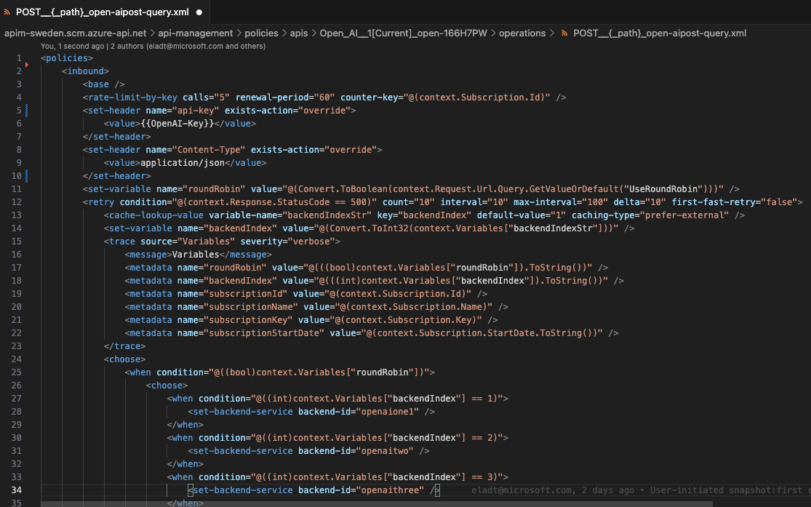
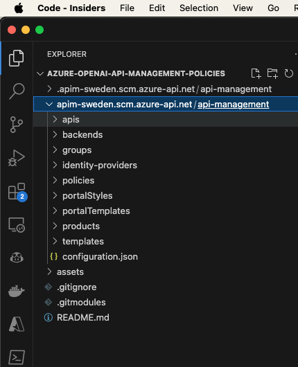
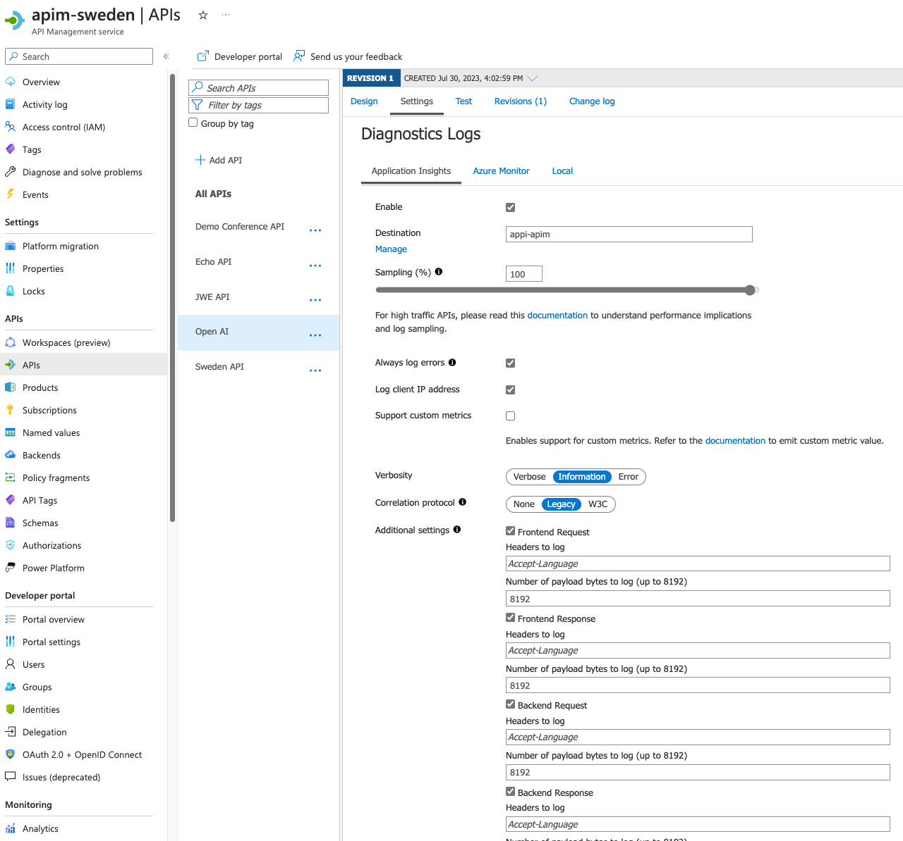
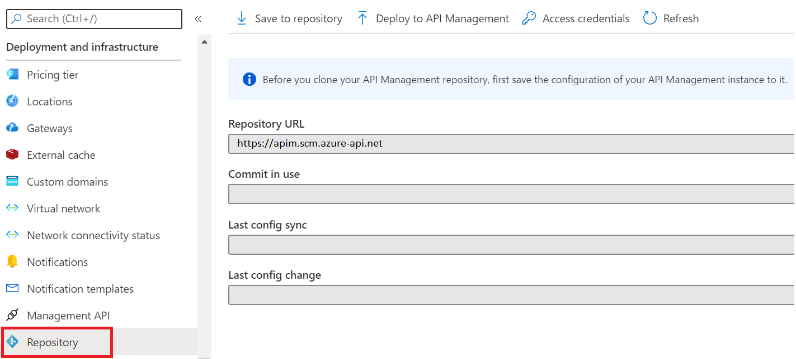
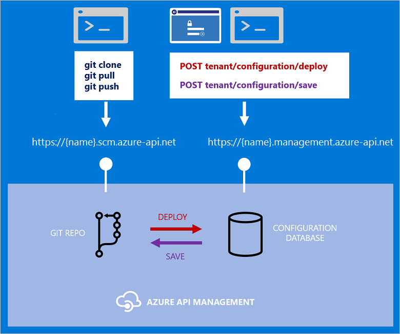

# Azure OpenAI: Managing usage and capasity with Azure API Management.

This article aims to provide guidance for organizations that have concerns when using OpenAI services.  
These concerns may include addressing auditing prompts and responses, capacity planning and limitations, error handling, and retry capabilities.  
In addition, organizations can increase their usage by creating an OpenAI instance pool and sharing resources with other consumers.  
  
To achieve all of the above and more, we will be using Azure OpenAI services via Azure API Management (APIM). 


[Azure API Management (APIM) Policies](#policies)


## Prerequisites
* If you don't have an [Azure subscription](https://learn.microsoft.com/en-us/azure/guides/developer/azure-developer-guide#understanding-accounts-subscriptions-and-billing), create an [Azure free account](https://azure.microsoft.com/free/?ref=microsoft.com&utm_source=microsoft.com&utm_medium=docs&utm_campaign=visualstudio) before you begin.  
* The Azure CLI version is 2.47.0 or later. Run az --version to find the version, and run az upgrade to upgrade the version. If you need to install or upgrade, see [Install Azure CLI](https://learn.microsoft.com/en-us/cli/azure/install-azure-cli).
* If you have multiple Azure subscriptions, select the appropriate subscription ID in which the resources should be billed using the [az account](https://learn.microsoft.com/en-us/cli/azure/account) command.
* Bash terminal


## <a name="policies"></a>Azure API Management (APIM) Policies

Azure API Management uses policies to modify API behavior by running sequential statements on the request or response.  
Some of the relevant policies for OpenAI include:
* ***rate-limit***: The rate-limit policy prevents API usage spikes by limiting the call rate to a specified number per period.
* ***validate-jwt***: The validate-jwt policy enforces the existence and validity of a supported JSON web token (JWT)
* ***retry***: The retry policy executes its child policies once and then retries their execution until the retry condition is met.
* ***cache-lookup-value***: The cache-lookup-value policy performs cache lookup by key and return a cached value. 
* ***set-backend-service***: edirect an incoming request to a different backend than the one specified in the API settings for that operation.

Other policies are available out of the box. Policies are applied inside the gateway between the API consumer and the managed API, allowing changes to both the inbound request and outbound response. For a complete list, see [API Management policy reference](https://learn.microsoft.com/en-us/azure/api-management/api-management-policies).

The policies configuration for the below image can be found in the Azure API Management configuration repository [here](apim-sweden.scm.azure-api.net/api-management/policies/apis/Open_AI__1[Current]_open-166H7PW/operations/POST__{_path}_open-aipost-query.xml):




## Workflow
1. Client applications access Azure OpenAI endpoints to perform text generation (completions) and model training (fine-tuning).
2. Azure Application Gateway provides a single point of entry to Azure OpenAI models and provides load balancing for APIs.

    > Note
    > Load balancing of stateful operations like model fine-tuning, deployments, and inference of fine-tuned models isn't supported.


3. Azure API Management enables security controls and auditing and monitoring of the Azure OpenAI models.
    a. In API Management, enhanced-security access is granted via Microsoft Entra groups with subscription-based access permissions.
    b. Auditing is enabled for all interactions with the models via Azure Monitor request logging.
    c. Monitoring provides detailed Azure OpenAI model usage KPIs and metrics, including prompt information and token statistics for usage traceability.

4. API Management connects to all Azure resources via Azure Private Link. This configuration provides enhanced security for all traffic via private endpoints and contains traffic in the private network.

5. Multiple Azure OpenAI instances enable scale-out of API usage to ensure high availability and disaster recovery for the service.


## GitHub API Management configuration repository

In this repository you will find the following files:
[apim-sweden.scm.azure-api.net](apim-sweden.scm.azure-api.net) sub-module contains the API Management configuration files.


APIM configuration files are stored in the [apim-sweden.scm.azure-api.net](apim-sweden.scm.azure-api.net) sub-module.


in the image that describes the repository structure, we can see it corresponds to the apim entities:  
apis, backends, products, policies, etc.



## KQL Query: Prompt usage monitoring


```
ApiManagementGatewayLogs
| where OperationId == 'post-query' //completions_create'
| extend model = tostring(parse_json(BackendResponseBody)['model'])
| extend prompt_tokens = parse_json(parse_json(BackendResponseBody)['usage'])['prompt_tokens']
| extend completion_tokens = parse_json(parse_json(BackendResponseBody)['usage'])['completion_tokens']
| extend total_tokens = parse_json(parse_json(BackendResponseBody)['usage'])['total_tokens']
| extend request_messages = substring(parse_json(parse_json(BackendRequestBody)['messages'])[0], 0, 100)
| extend response_choices = substring(parse_json(parse_json(BackendResponseBody)['choices'])[0], 0, 100)
| extend requestBody = parse_json(BackendRequestBody)
| extend responseBody = parse_json(BackendResponseBody)
```


## Integrating Azure Functions with Azure Data Explorer (ADX)


## Azure API Management settings



## Trace


### Headers


| Header Name   |      Value      | Aim |
|----------|-------------|------|
| Ocp-Apim-Subscription-Key |  [API-KEY] | By publishing APIs through API Management, you can easily secure API access using subscription keys. Users who need to consume the published APIs must include a valid subscription key in HTTP requests when calling those APIs. |
| Ocp-Apim-Trace |    true   |   The [Trace policy](https://learn.microsoft.com/en-us/azure/api-management/trace-policy) adds a custom trace to the request tracing output in the test console when tracing is triggered, that is, Ocp-Apim-Trace request header is present and set to true and Ocp-Apim-Subscription-Key request header is present and holds a valid key that allows tracing. |
| Content-Type | application/json |    OpenAI service expect this header to be presence and contain a json content |


## DevOps: API Management configuration deployment 

### Automate configuration deployment your API Management service configuration using Git

[How to save and configure your API Management service configuration using Git](https://learn.microsoft.com/en-us/azure/api-management/api-management-configuration-repository-git)





### Get access credentials

To clone a repository, in addition to the URL to your repository, your need a username and a password.

1. On the **Repository** page, select **Access credentials** near the top of the page.

2. Note the username provided on the **Access credentials** page.

3. To generate a password, first ensure that the **Expiry** is set to the desired expiration date and time, and then select **Generate**.
4. Set the credentials in your Git client to the username and password provided on the **Access credentials** page.
```
# windows
git config --global credential.helper wincred

# generic
git config --global credential.provider generic

# mac
git config --global credential.helper osxkeychain

git config credential.https://{name}.scm.azure-api.net.username apim
git config credential.https://{name}.scm.azure-api.net.password apim

# reset helper if needed: git config --global --unset credential.helper
```

> Make a note of this password. 
> Once you leave this page the password will not be displayed again.


### Clone the repository to your local machine


#### Clone / Add Submodule

```
# clone
git clone https://{name}.scm.azure-api.net/

# clone with credentials
git clone https://username:password@{name}.scm.azure-api.net/

# create submodule
git submodule add https://{name}.scm.azure-api.net   

# if using branch other than master
git checkout <branch_name>

```

<!-- 

 -->

[Terrafrom - Azure API Management](https://registry.terraform.io/providers/hashicorp/azurerm/latest/docs/resources/api_management)  