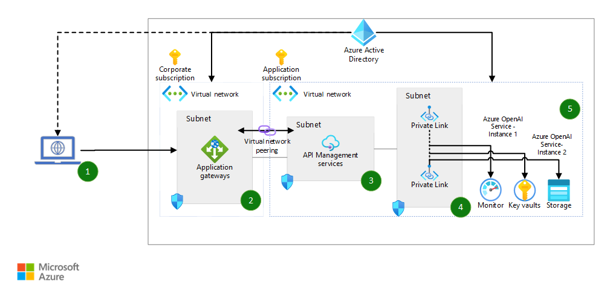

# Azure OpenAI logging implementation with Azure API Management.


## Workflow
1. Client applications access Azure OpenAI endpoints to perform text generation (completions) and model training (fine-tuning).
2. Azure Application Gateway provides a single point of entry to Azure OpenAI models and provides load balancing for APIs.

    > Note
    > Load balancing of stateful operations like model fine-tuning, deployments, and inference of fine-tuned models isn't supported.


3. Azure API Management enables security controls and auditing and monitoring of the Azure OpenAI models.
    a. In API Management, enhanced-security access is granted via Microsoft Entra groups with subscription-based access permissions.
    b. Auditing is enabled for all interactions with the models via Azure Monitor request logging.
    c. Monitoring provides detailed Azure OpenAI model usage KPIs and metrics, including prompt information and token statistics for usage traceability.

4. API Management connects to all Azure resources via Azure Private Link. This configuration provides enhanced security for all traffic via private endpoints and contains traffic in the private network.

5. Multiple Azure OpenAI instances enable scale-out of API usage to ensure high availability and disaster recovery for the service.


## KQL Query: Prompt usage monitoring


```
ApiManagementGatewayLogs
| where OperationId == 'post-query' //completions_create'
| extend model = tostring(parse_json(BackendResponseBody)['model'])
| extend prompt_tokens = parse_json(parse_json(BackendResponseBody)['usage'])['prompt_tokens']
| extend completion_tokens = parse_json(parse_json(BackendResponseBody)['usage'])['completion_tokens']
| extend total_tokens = parse_json(parse_json(BackendResponseBody)['usage'])['total_tokens']
| extend request_messages = substring(parse_json(parse_json(BackendRequestBody)['messages'])[0], 0, 100)
| extend response_choices = substring(parse_json(parse_json(BackendResponseBody)['choices'])[0], 0, 100)
| extend requestBody = parse_json(BackendRequestBody)
| extend responseBody = parse_json(BackendResponseBody)
```


## Azure API Management settings:
