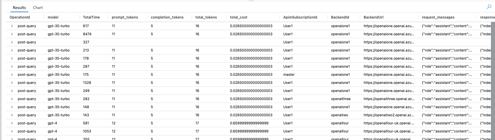

<!-- # OpenAI usage management with Azure API Management (APIM) -->
# How to use Azure API Management (APIM) for usage management of OpenAI services
This article aims to provide guidance for organizations that have concerns when using OpenAI services.  
These concerns may include addressing **auditing prompts and responses, capacity planning and limitations, error handling, and retry capabilities**.  
In addition, **organizations can increase their usage by creating an OpenAI instance pool and sharing resources with other consumers**.  
  
To achieve all of the above and more, we will be using Azure OpenAI services via Azure API Management (APIM). 

---

###### Preps
[Prerequisites](#prerequisites)  
[Workflow](#workflow)  
###### Setting up Azure API Management (APIM) for OpenAI 
[Setup: Azure API Management Key Vault integration](#keyvault)  
[Setup: Azure API Management Backend services](#policies)  
[Setup: Azure API Management API with policies](#policies)  
[Setup: Azure API Management logging settings](#logging)  
[Setup: Azure OpenAI service Managed Identity access control](#identity)

###### Deployment & Testing
[Azure Data Explorer (ADX): Run KQL Queries to extract usage details](#kql)  
[Testing with Postman](#postman)  
[DevOps: API Management configuration deployment](#devops)  
[API Management configuration git repository](#github)  
###### Misc
[Further reading](#further)

## <a name="workflow"></a>Prerequisites
* If you don't have an [Azure subscription](https://learn.microsoft.com/en-us/azure/guides/developer/azure-developer-guide#understanding-accounts-subscriptions-and-billing), create an [Azure free account](https://azure.microsoft.com/free/?ref=microsoft.com&utm_source=microsoft.com&utm_medium=docs&utm_campaign=visualstudio) before you begin.  
* The Azure CLI version is 2.47.0 or later. Run az --version to find the version, and run az upgrade to upgrade the version. If you need to install or upgrade, see [Install Azure CLI](https://learn.microsoft.com/en-us/cli/azure/install-azure-cli).
* If you have multiple Azure subscriptions, select the appropriate subscription ID in which the resources should be billed using the [az account](https://learn.microsoft.com/en-us/cli/azure/account) command.
* Understand [Azure API Management terminology](https://learn.microsoft.com/en-us/azure/api-management/api-management-terminology).
* [Create an Azure API Management instance](https://learn.microsoft.com/en-us/azure/api-management/get-started-create-service-instance).


## <a name="workflow"></a> Workflow
1. There are two types of users who will use the OpenAI service: Developers and End Users.  
Developers need to provide the Azure [API Management Subscription Key](https://learn.microsoft.com/en-us/azure/api-management/api-management-subscriptions). This key will function similarly to the OpenAI API key used by the IDE.  
End Users, on the other hand, will authenticate themselves through Azure Active Directory (AAD) and access the service with a JWT token.  
2. Among other security components, the [Azure API Management (APIM)](https://learn.microsoft.com/en-us/azure/api-management/api-management-key-concepts) service is protected by [Azure Web Application Firewall on Azure Application Gateway](https://learn.microsoft.com/en-us/azure/web-application-firewall/ag/ag-overview), [Azure Firewall](https://learn.microsoft.com/en-us/azure/firewall/overview), [DDOS protection](https://learn.microsoft.com/en-us/azure/ddos-protection/ddos-protection-overview) and other security components.  
3. All communication with OpenAI services is managed through the APIM service, which controls access for external users and applications.  
Incoming requests are subjected to various policies, including rate limiting, JWT validation, tracing, retry, caching, and more.  
Moreover, all communication between the APIM service and OpenAI services is internal and uses [private endpoints](https://learn.microsoft.com/en-us/azure/private-link/private-endpoint-overview).
4. The APIM service will use the appropriate authentication method based on the calling party and application type.
5. APIM will use its own [Managed Identity](https://learn.microsoft.com/en-us/entra/identity/managed-identities-azure-resources/overview) service principle identity for calls routed to the Azure OpenAI service.
6. To monitor, track, and receive alerts for OpenAI service usage, we will utilize [Azure Monitor's](https://learn.microsoft.com/en-us/azure/azure-monitor/overview) built-in integration with the APIM service.

---

## Setting up Azure API Management (APIM) for OpenAI
>  [Azure API Management](https://learn.microsoft.com/en-us/azure/api-management/api-management-key-concepts) is a hybrid, multicloud management platform for APIs across all environments. As a platform-as-a-service, API Management supports the complete API lifecycle.  

### <a name="keyvault"></a>Setup: Azure API Management Key Vault integration

* [ ] If no Key Vault exists, create a new API management integrated Key Vault:  
[Use managed identities in Azure API Management](https://learn.microsoft.com/en-us/azure/api-management/api-management-howto-use-managed-service-identity)
* [ ] Navigate to API Management service > APIs > Named values > "+Add"
* [ ] In "Type" select "Key Vault"
* [ ] Press "Select"
* [ ] Select the formally created Key Vault and the desired secret
* [ ] Click "Save"


### <a name="backend"></a>Setup: Azure API Management Backend services
> *Managed Identities* are a feature of *Azure Active Directory* that allows Azure resources to authenticate themselves as service principal with other supported Azure resources.
> This way *Azure API Management* can authenticate itself with *Azure OpenAI* services. **In this method there is no need to store any credentials in the APIM configuration**, e.g no need for OpenAI api-key.

Backends are the API Management representation of the backend services that API Management proxies. this way we can configure the Azure OpenAI services as backends. Each backend configuration will contain refernce to api-key saved in Azure Key Vault

* [ ] Navigate to API Management service > APIs > Backends > "+Add"
* [ ] Enter OpenAI service url with the "/openai" suffix, e.g "https://openaitwo.openai.azure.com/openai"
* [ ] Add OpenAI api-key header if needed, in case not using managed identities
* [ ] Click "Create".

 

### <a name="policies"></a>Setup: Azure API Management policies  
###### Policy definitions used in this guide can be found in [policies](/policies) folder.


> For the API to be flexable for any URL path route, we are setting the Frontend URL to be a `/{*path}` like so.
> 

**Option I**: Configure policies manually using Azure Portal
* [ ] Navigate to API Management service > APIs > "+Add API"
* [ ] Navigate to API Management service > APIs > Your API > "+Add operation"
* [ ] Navigate to API Management service > APIs > Your API > Operations > Your operation > "Add policy"
* [ ] Add the desired policies, an OpenAI example can be found [here](/.apim-sweden.scm.azure-api.net/api-management/policies/apis/Open_AI__1[Current]_open-166H7PW/operations/POST__{_path}_open-aipost-query.xml)
* [ ] Save the changes

**Option II**: Configure policies manually using Visual Studio Code
* [ ] Open Visual Studio Code
* [ ] Install the [Azure API Management extension](https://marketplace.visualstudio.com/items?itemName=ms-azuretools.vscode-apimanagement)
* [ ] Navigate to API Management configuration repo > policies > apis > Your API
* [ ] Modify the desired policy, an OpenAI example can be found [here](/.apim-sweden.scm.azure-api.net/api-management/policies/apis/Open_AI__1[Current]_open-166H7PW/operations/POST__{_path}_open-aipost-query.xml)
* [ ] Save the changes


**Option III**: Deploy service configuration from git to the API Management service instance  
> The full guide can be found in [How to save and configure your API Management service configuration using Git](https://learn.microsoft.com/en-us/azure/api-management/api-management-configuration-repository-git#deploy-service-configuration-changes-to-the-api-management-service-instance)
* [ ] Clone the ".apim-sweden.scm.azure-api.net" repository to your repository.
* [ ] Navigate to API Management service > Deployment + infrastructure > Repository
* [ ] Press "Deploy to API Management"
* [ ] On the Deploy repository configuration page, enter the name of the branch containing the desired configuration changes, and optionally select Remove subscriptions of deleted products. Select Save.  


###### Policies
Azure API Management uses policies to modify API behavior by running sequential statements on the request or response.  
Some of the relevant policies for OpenAI include:
* [*rate-limit*](https://learn.microsoft.com/en-us/azure/api-management/rate-limit-policy): The rate-limit policy prevents API usage spikes by limiting the call rate to a specified number per period.  
* [*validate-jwt*](https://learn.microsoft.com/en-us/azure/api-management/validate-jwt-policy): The validate-jwt policy enforces the existence and validity of a supported JSON web token (JWT).  
* [*set-header*](https://learn.microsoft.com/en-us/azure/api-management/set-header-policy): The set-header policy sets the value of a header or adds a new header to the request or response, e.g OpenAI api-key header.
* [*retry*](https://learn.microsoft.com/en-us/azure/api-management/retry-policy): The retry policy executes its child policies once and then retries their execution until the retry condition is met.
* [*cache-lookup-value*](https://learn.microsoft.com/en-us/azure/api-management/cache-lookup-value-policy): The cache-lookup-value policy performs cache lookup by key and return a cached value.  
* [*set-backend-service*](https://learn.microsoft.com/en-us/azure/api-management/set-backend-service-policy): edirect an incoming request to a different backend than the one specified in the API settings for that operation.  
* [*return-response*](https://learn.microsoft.com/en-us/azure/api-management/return-response-policy): The return-response policy returns a specified response to the caller. for adding a custom response data to the request.

Other policies are available out of the box. Policies are applied inside the gateway between the API consumer and the managed API, allowing changes to both the inbound request and outbound response. For a complete list, see [API Management policy reference](https://learn.microsoft.com/en-us/azure/api-management/api-management-policies).  


### <a name="logging"></a>Setup: Azure API Management logging settings
For us to be able to collect usage data we need to enable logging for the API Management service.

* [ ] Navigate to API Management service > APIs > Your API > Settings
* [ ] Scroll down to "Diagnostics logs" and select "Azure Monitor"
* [ ] Check the Backend Request and the Frontend Request checkboxes 
* [ ] Set the payload threshold to the desired value, e.g 4096
* [ ] Click "Save"


### <a name="identity"></a>Setup: Azure OpenAI service Managed Identity access control
> Managed identities for Azure resources is a feature of Azure Active Directory.  
> It simplifies the management of identities for Azure resources by providing Azure services with an automatically managed identity in Azure Active Directory (Azure AD). You can use the identity to authenticate to any service that supports Azure AD authentication, including Key Vault, without any credentials in your code.

In order to let the API Management service authenticate itself with the Azure OpenAI service, we need to grant the API Management service access to the Azure OpenAI service.

* [ ] Navigate to Azure OpenAI service > Access control (IAM) > "+Add"
* [ ] Select "Add role assignment"
* [ ] Select "Cognitive Services OpenAI User" for the Role and press "Next"
* [ ] Select the "Managed Identity" option as the "Assign access to"
* [ ] Press "+ Select Members"
* [ ] Select the API Management service in the Managed Identity select box.
* [ ] Select the API Management service and press "Select"
* [ ] Press "Review + assign"
* [ ] Repeat the process for all the OpenAI services that you want to grant access to.


---

## Deployment & Testing

### <a name="kql"></a>Azure Data Explorer (ADX): Run KQL Queries to extract usage details


#### Query prompt details

```
ApiManagementGatewayLogs
| where OperationId == 'post-query' and IsRequestSuccess==true //completions_create'
| extend response = parse_json(ResponseBody)
| extend model = tostring(response.model)
| extend prompt_tokens = response.usage.prompt_tokens
| extend completion_tokens = response.usage.completion_tokens
| extend total_tokens = response.usage.total_tokens
| extend cost_prompt = case(
    model == "gpt-35-turbo", 0.0015, 
    model == "gpt-4", 0.03, 
    0.00)
| extend cost_completion = case(
    model == "gpt-35-turbo", 0.002, 
    model == "gpt-4", 0.06, 
    0.00)
| extend total_cost = (prompt_tokens*cost_prompt)+(completion_tokens*cost_completion)
| extend subscription_id = response.subscription_id
| extend subscription_name = response.subscription_name
| extend request = parse_json(BackendRequestBody)
| extend request_messages = substring(request.messages[0], 0, 100)
| extend response_choices = substring(response.choices[0], 0, 100)
| project OperationId, model, TotalTime, //BackendTime, 
prompt_tokens, completion_tokens, total_tokens, total_cost, ApimSubscriptionId, BackendId, BackendUrl, request_messages, response_choices
```
##### Output



#### Query usage analytics

```
ApiManagementGatewayLogs
| where OperationId == 'post-query' and IsRequestSuccess==true //completions_create'
| extend response = parse_json(ResponseBody)
| extend model = tostring(response.model)
| extend user = ApimSubscriptionId
| extend prompt_tokens = toint(response.usage.prompt_tokens)
| extend completion_tokens = toint(response.usage.completion_tokens)
| extend total_tokens = toint(response.usage.total_tokens)
| extend cost_prompt = case(
    model == "gpt-35-turbo", 0.0015, 
    model == "gpt-4", 0.03, 
    0.00)
| extend cost_completion = case(
    model == "gpt-35-turbo", 0.002, 
    model == "gpt-4", 0.06, 
    0.00)
| extend total_cost = (prompt_tokens*cost_prompt)+(completion_tokens*cost_completion)
| summarize 
    total_duration = sum(TotalTime), 
    total_prompt_tokens = sum(prompt_tokens), 
    total_completion_tokens = sum(completion_tokens), 
    total_all_tokens = sum(total_tokens),
    total_all_cost = sum(total_cost)
    by model
| render piechart 
```
##### Output


### <a name="postman"></a>Testing with Postman

We have severel options for testing the API, one of them is using Postman.
We generated in Postman two identical requests, one will go through the API Management service and the other will go directly to the OpenAI service.

You can import the configuration from [/postman/azure-open-ai.postman_collection.json](/postman/azure-open-ai.postman_collection.json)

* [ ] Open the imported collection "azure-open-ai"
* [ ] Navigate to the variables tab
* [ ] Set the "openai-api-key" variable to the openAI service api-key
* [ ] Set the "apim-subscription-key" variable to the API Management service subscription key
* [ ] Go to the openai request and press "Send"
* [ ] Go to the apim request and press "Send"
* [ ] Compare the responses (they should be identical)


##### Azure API Management tracing headers


| Header Name   |      Value      | Aim |
|----------|-------------|------|
| Ocp-Apim-Subscription-Key |  [API-KEY] | By publishing APIs through API Management, you can easily secure API access using subscription keys. Users who need to consume the published APIs must include a valid subscription key in HTTP requests when calling those APIs. |
| Ocp-Apim-Trace |    true   |   The [Trace policy](https://learn.microsoft.com/en-us/azure/api-management/trace-policy) adds a custom trace to the request tracing output in the test console when tracing is triggered, that is, Ocp-Apim-Trace request header is present and set to true and Ocp-Apim-Subscription-Key request header is present and holds a valid key that allows tracing. |
| Content-Type | application/json |    OpenAI service expect this header to be presence and contain a json content |


### <a name="github"></a>API Management configuration git repository

In this repository you will find the following files:
[apim-sweden.scm.azure-api.net](apim-sweden.scm.azure-api.net) sub-module contains the API Management configuration files.


APIM configuration files are stored in the [apim-sweden.scm.azure-api.net](apim-sweden.scm.azure-api.net) sub-module.


in the image that describes the repository structure, we can see it corresponds to the apim entities:  
apis, backends, products, policies, etc.


### DevOps: API Management configuration deployment 

#### Automate configuration deployment your API Management service configuration using Git

[How to save and configure your API Management service configuration using Git](https://learn.microsoft.com/en-us/azure/api-management/api-management-configuration-repository-git)


#### Get access credentials

To clone a repository, in addition to the URL to your repository, your need a username and a password.

* [ ] On the **Repository** page, select **Access credentials** near the top of the page.
* [ ] Note the username provided on the **Access credentials** page.
* [ ] To generate a password, first ensure that the **Expiry** is set to the desired expiration date and time, and then select **Generate**.
* [ ] Set the credentials in your Git client to the username and password provided on the **Access credentials** page.
* [ ] Run the following commands for setting the credentials in your Git client:

```
# windows
git config --global credential.helper wincred

# generic
git config --global credential.provider generic

# mac
git config --global credential.helper osxkeychain

git config credential.https://{name}.scm.azure-api.net.username apim
git config credential.https://{name}.scm.azure-api.net.password apim

# reset helper if needed: git config --global --unset credential.helper
```

> Make a note of this password. 
> Once you leave this page the password will not be displayed again.


### Clone the repository to your local machine


#### Clone / Add Submodule

```
# clone
git clone https://{name}.scm.azure-api.net/

# clone with credentials
git clone https://username:password@{name}.scm.azure-api.net/

# create submodule
git submodule add https://{name}.scm.azure-api.net   

# if using branch other than master
git checkout <branch_name>

```

 


[Terrafrom - Azure API Management](https://registry.terraform.io/providers/hashicorp/azurerm/latest/docs/resources/api_management)  

## <a name="further"></a>Further reading

#### Azure API Management Service

[How to save and configure your API Management service configuration using Git](https://learn.microsoft.com/en-us/azure/api-management/api-management-configuration-repository-git#deploy-service-configuration-changes-to-the-api-management-service-instance)  
<sub>Each API Management service instance maintains a configuration database that contains information about the configuration and metadata for the service instance. Changes can be made to the service instance by changing a setting in the Azure portal, using Azure tools such as Azure PowerShell or the Azure CLI, or making a REST API call. In addition to these methods, you can manage your service instance configuration using Git.</sub>

[Policies in Azure API Management](https://learn.microsoft.com/en-us/azure/api-management/api-management-howto-policies)  
<sub>In Azure API Management, API publishers can change API behavior through configuration using policies. Policies are a collection of statements that are run sequentially on the request or response of an API</sub>

[API Management policy expressions](https://learn.microsoft.com/en-us/azure/api-management/api-management-policy-expressions)  
<sub>This article discusses policy expressions syntax in C# Each expression has access to the implicitly provided context variable and an allowed subset of .NET Framework types.</sub>

[Tutorial: Import and publish your first API](https://learn.microsoft.com/en-us/azure/api-management/import-and-publish)  
<sub>This tutorial shows how to import an OpenAPI specification backend API in JSON format into Azure API Management. Microsoft provides the backend API used in this example, and hosts it on Azure at https://conferenceapi.azurewebsites.net.</sub>

[Use a virtual network to secure inbound and outbound traffic for Azure API Management](https://learn.microsoft.com/en-us/azure/api-management/virtual-network-concepts?tabs=stv2)  
<sub>API Management provides several options to secure access to your API Management instance and APIs using an Azure virtual network. API Management supports the following options. Available options depend on the [service tier](https://learn.microsoft.com/en-us/azure/api-management/api-management-features) of your API Management instance.</sub>

#### Azure OpenAI Service
[Configure Azure AI services virtual networks](https://learn.microsoft.com/en-us/azure/ai-services/cognitive-services-virtual-networks?tabs=portal)  
<sub>Azure AI services provide a layered security model. This model enables you to secure your Azure AI services accounts to a specific subset of networks. When network rules are configured, only applications that request data over the specified set of networks can access the account. You can limit access to your resources with request filtering, which allows requests that originate only from specified IP addresses, IP ranges, or from a list of subnets in [Azure Virtual Networks](https://learn.microsoft.com/en-us/azure/virtual-network/virtual-networks-overview).</sub>


#### Tooling
[Introducing the Secret Variable Type in Postman](https://blog.postman.com/introducing-secret-variable-type-in-postman/)  
<sub>In Postman, [variables](https://learning.postman.com/docs/sending-requests/variables/) enable you with data reusability and also foster [collaboration](https://blog.postman.com/get-more-out-of-postman-by-collaborating-with-your-team/) when developing and testing API requests. Variables are often used to store sensitive information such as API credentials that are needed in the authentication and authorization of API requests.</sub>
[Azure API Management extension for Visual Studio Code](https://marketplace.visualstudio.com/items?itemName=ms-azuretools.vscode-apimanagement)  
<sub>Use the Azure API Management extension to perform common management operations on your Azure API Management service instances without switching away from Visual Studio Code.</sub>
